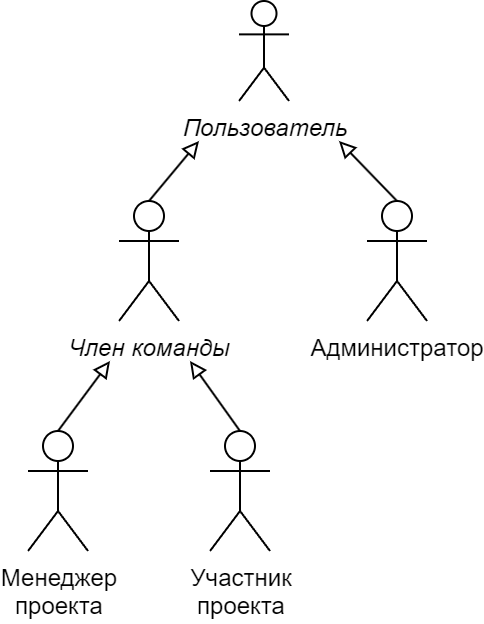

# Бизнес-требования
Дополнительное текстовое описание к [диаграмме](business_requirements.png).

## Действующие лица
* ДЛ по отношению к конкретному проекту:
  + Участник проекта - член команды проекта, который может взаимодействовать только с задачами, которые назначены ему
  + Менеджер проекта - член команды проекта, который может взаимодействовать с любыми задачами и может менять сам проект
  + *Член команды* - либо участник проекта, либо менеджер проекта
* ДЛ по отношению к системе в целом:
  + Администратор - пользователь, который имеет возможность управлять другими пользователями системы и любыми проектами
  + *Пользователь* - любой зарегистрованный пользователь системы

[Вспомогательная диаграмма действующих лиц](auxiliary/characters.png):

## Варианты использования
* Участник проекта:
  + Управлять своими задачами
  + Получить информацию о проекте
* Менеджер проекта:
  + Управлять задачами
  + Управлять командной проекта
  + Управлять своими проектами
  + Получить информацию о проекте
* Администратор:
  + Управлять пользователями
  + Управлять проектами
  + Получить информацию о проекте
